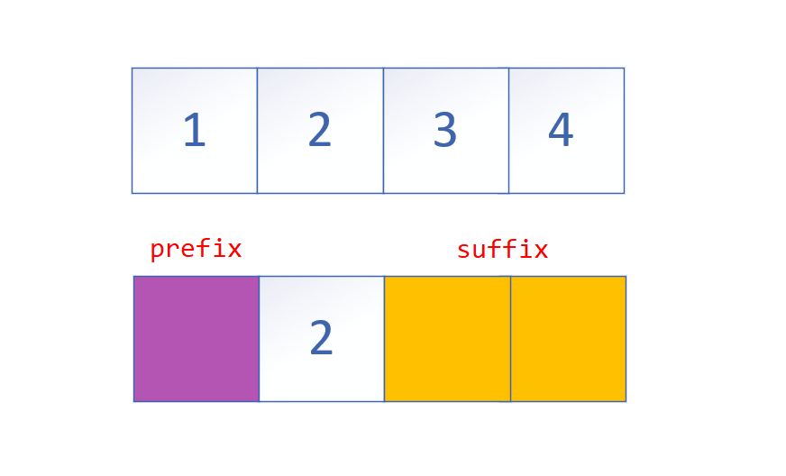
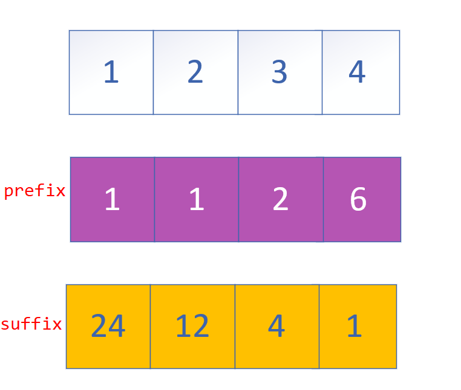

# Product of Array Except Self

## Topic

[238. Product of Array Except Self](https://leetcode.com/problems/product-of-array-except-self/)

Given an array `nums` of *n* integers where *n* > 1,  return an array `output` such that `output[i]` is equal to the product of all the elements of `nums` except `nums[i]`.

**Example:**

```
Input:  [1,2,3,4]
Output: [24,12,8,6]
```

**Constraint:** It's guaranteed that the product of the elements of any prefix or suffix of the array (including the whole array) fits in a 32 bit integer.

**Note:** Please solve it **without division** and in O(*n*).

**Follow up:**
Could you solve it with constant space complexity? (The output array **does not** count as extra space for the purpose of space complexity analysis.)


## Intuition

​	The first thing that came to mind is that we need to use `multiplication` since we are supposed to solve it without division.


​	A picture sprang to mind:

<div align="center">  </div><br>


## Explanation

<div align="center">  </div><br>

`Left`: Store the prefix

`Right`: Store the suffix

`Res`: Multiply `Left` and `Right`


## Code

```java
class Solution {
    public int[] productExceptSelf(int[] nums) {
        // Initialization
        int n = nums.length;
        int[] left = new int[n];
        int[] right = new int[n];
        int[] res = new int[n];
        
        left[0] = 1;
        right[n-1] = 1;
        
        // Left -> Right
        for (int i = 1; i < n; i++) {
            left[i] = nums[i-1] * left[i-1];
        }
        
        // Right -> Left
        for (int i = n-2; i > -1; i--) {
            right[i] = nums[i+1] * right[i+1];
        }

        for (int i = 0; i < n; i++) {
            res[i] = left[i] * right[i];
        }
        return res;        
    }
}

```

