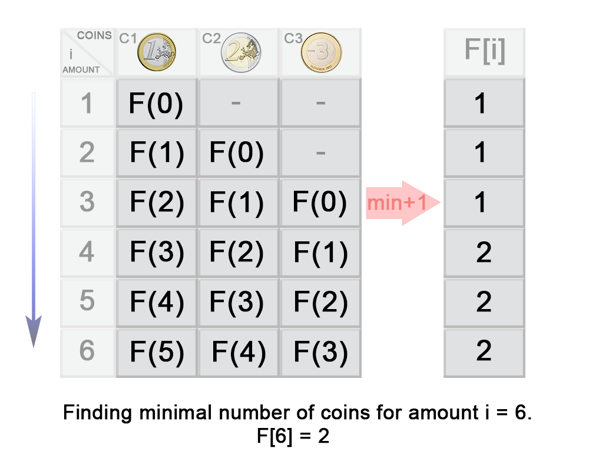

# 322. Coin Change

## 题目

You are given coins of different denominations and a total amount of money *amount*. Write a function to compute the fewest number of coins that you need to make up that amount. If that amount of money cannot be made up by any combination of the coins, return `-1`.

**Example 1:**

```
Input: coins = [1, 2, 5], amount = 11
Output: 3 
Explanation: 11 = 5 + 5 + 1
```

**Example 2:**

```
Input: coins = [2], amount = 3
Output: -1
```

**Note**:
You may assume that you have an infinite number of each kind of coin.


## 思路

这题是一道非常经典的动态规划问题。

首先我们先从一般的角度来思考这道问题：


顶点值代表剩下所需凑齐的金额，边代表我们每次的选择，我们的目标是是获得最少的边，让顶点值为0，即用最少的```coin```来凑齐我们的 ```amount``` 。

从图中可以看出，我们在寻找的过程中，实际上重复了许多步骤。就像本来可以一次性做好的东西，却反反复复，来来去去计算，这样当我们需要解决大规模的问题时，就是显得效率无比低下。

当一个大问题可以拆解为多个**子问题**时，我们只需求得当前的最优子结构，```bottom-up``` 往上走，便可求得原问题的最优解。

**子问题**！

**子问题**！

**子问题！**


```bottom-up``` 对逐个子问题一一击破。```F(n)``` 代表```n```元所需硬币的最少数量，那么我们知道现在```coin```的面值有```[1, 2, 5]``` ，要想知道 ```F(n)``` ，就必须得知道```F(n - 1)``` , ```F(n - 2)``` 以及```F(n - 5)```中的最小值且加```1``` (1 代表我们当前的选择) ，显然，之前的值我们已经计算好了。注意，我们必须确保```n - 面值``` 要大于`0` 。





## 代码

**Java**

```java
class Solution {
    public int coinChange(int[] coins, int amount) {
        // Initialization of dp array
        int[] dp = new int[amount + 1];
        Arrays.fill(dp, amount + 1);
        dp[0] = 0;
        
        // DP process
        for (int i = 0; i < dp.length; i++) {
            for (int coin : coins) {
                if (i - coin >= 0) {
                    dp[i] = Math.min(dp[i - coin] + 1, dp[i]);
                }
            }
        }
        
        // Return the result
        return dp[amount] > amount ? -1 : dp[amount];
    }
}

```

**Python**

```python
class Solution:
    def coinChange(self, coins: List[int], amount: int) -> int:
        dp = [amount + 1 for i in range(amount + 1)]
        dp[0] = 0
        for i in range(len(dp)):
            for coin in coins:
                if i - coin >= 0:
                    dp[i] = min(dp[i - coin] + 1, dp[i])
        return dp[-1] if dp[-1] != amount + 1 else -1
        
```

