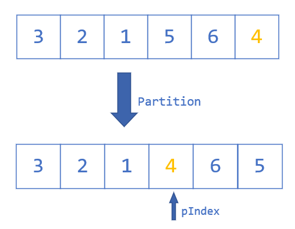

# Quick Sort

Quick Sort，中文名快速排序，是一个非常强大的排序算法，今天我们就来研究一下。

首先，快速排序用到了`分治`的思想，`分而治之，逐个击破`。

先看一个例子：

## Pivot

什么是`pivot`？

**`pivot`是一个元素**

你可以想象成，`pivot`就是一个对你来说特别特别重要的人（数组里面特别特别重要的元素），

这里默认当前数组的最后一个元素是`pivot`。

## Partition

`Partition`就是我们的任务：**为`pivot`找一个家，并记录家的位置**

为`pivot`找一个家，**使得在他左边的元素，全部比他小或等于他，他右边的元素都比他大。**

那么怎么记录这个家的地址呢？我们用`pIndex`来记录当前`pivot`最终放置的位置。

找到之后，我们的任务就圆满完成了，剩下的让别人去做！

> 遇到递归的问题一定一定要从“上帝视角”来审视问题，只关心每一层的任务。

找到家之后，我们知道`pivot`左边的元素比自己小，右边的元素比自己大，我们只需要再分别对其左右进行排序即可（递归的过程）。

### Process

过程如何实现？

From the very beginning:

`pIndex`在数组的第一个位置

`pivot`是数组的最后一个元素

