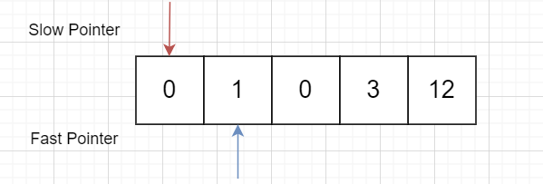
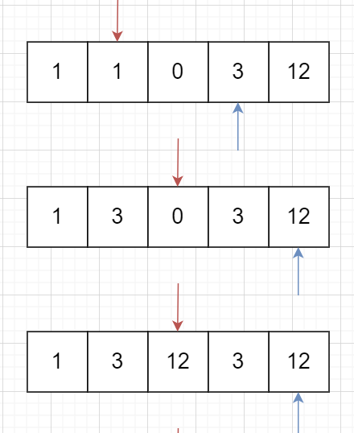
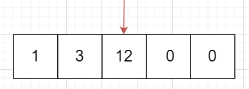

# 283. Move Zeroes

 ## Topic

Given an array `nums`, write a function to move all `0`'s to the end of it while maintaining the relative order of the non-zero elements.

**Example:**

```
Input: [0,1,0,3,12]
Output: [1,3,12,0,0]
```

**Note**:

1. You must do this **in-place** without making a copy of the array.
2. Minimize the total number of operations.


## Explanation

这是一道`array` 的题目，像这种`in-place`移来移去的题目，很多时候都要用到 `two pointers`。

为什么？当然是因为双指针可以在`O(n)`的复杂度内完成`in-place`的操作，可谓是一个超级武器。


首先，搞清楚快慢指针。

`fast-pointer`: 快速地`scan` 数组的元素，找到非零的就停下，等慢指针更新完就继续扫。

`slow-pointer`: 慢指针：从左到右走，每次走一步，并更新数组元素的值。







最后，等`fast-pointer`扫完之后，数组已经把非零元素的值全部更新好了，我们只需要把剩余的元素全部置`0`。




## Code

**Java**

```java
class Solution {
    public void moveZeroes(int[] nums) {
        // Slow pointer
        int slow = 0;
        
        // Fast pointer
        for (int fast = 0; fast < nums.length; fast++) {
            if (nums[fast] != 0) {
                nums[slow++] = nums[fast];
            }
        }
        
        // Set zeros
        for (int i = slow; i < nums.length; i++) {
            nums[i] = 0;
        }
    }
}

```

**Python**

```python
class Solution:
    def moveZeroes(self, A: List[int]) -> None:
        """
        Do not 
        return anything, modify nums in-place instead.
        """
        slow = 0
        for fast in range(len(A)):
            if A[fast] != 0:
                A[slow] = A[fast]
                slow += 1
        A[slow:] = [0 for i in range(slow, len(A))]
		
```

