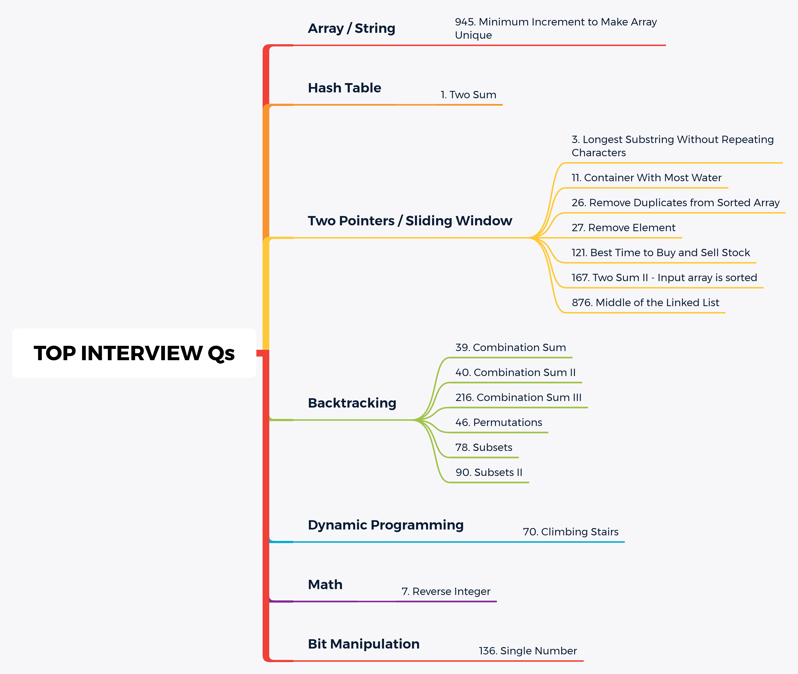

# Algo

Study notes for data structures & algorithms

## Data Structures

### Array

- [Merge Sorted Array](https://github.com/ceezyyy/algo/blob/master/Arrays%2C%20Strings/arrays-strings/src/MergeSortedArray/Solution.java)

### LinkedList

### Stack

### Queue

### Hashtable

### Binary Tree

- [Fundamental Traversal](https://github.com/ceezyyy/algo/blob/master/Tree%2C%20Binary%20Tree%2C%20BST/fundamental-traversal.md)
- [Solve Tree Problems Recursively](https://github.com/ceezyyy/algo/blob/master/Tree%2C%20Binary%20Tree%2C%20BST/solve-tree-problems-recursively.md)
- [Practices For Binary Tree](https://github.com/ceezyyy/algo/blob/master/Tree%2C%20Binary%20Tree%2C%20BST/practice.md)
- [BST]()

### Heap

### Skip List

### Graph

### Tire

## Algorithms

### Recursion

### Sorting

### Binary Search

### Searching

### Hash

### Greedy

### Divide and conquer

### Backtracking

### DP

### KMP

## Top Interview Questions

  
 

